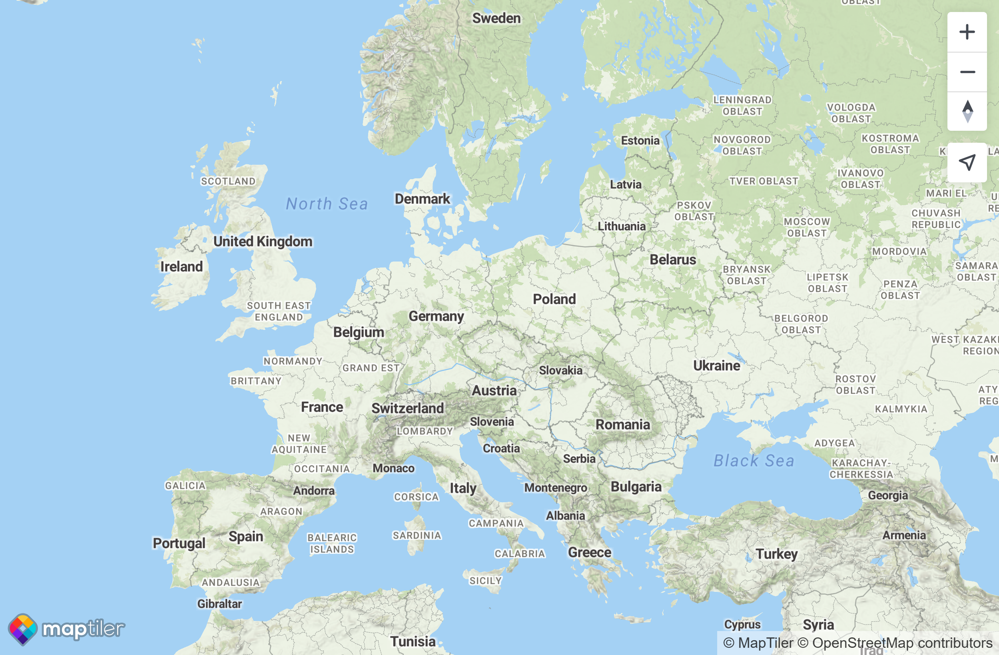
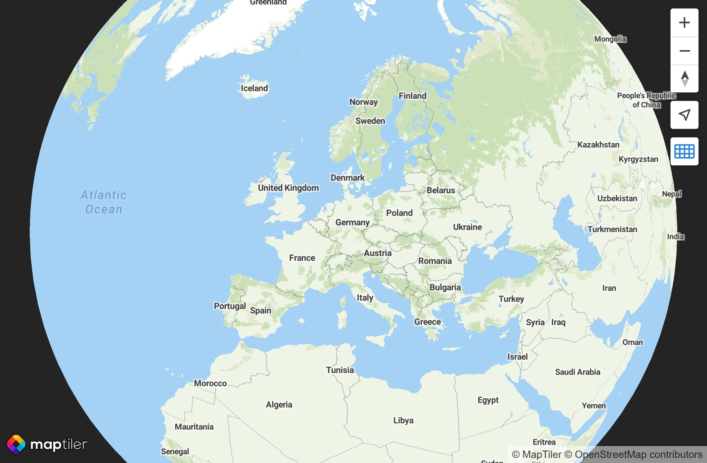
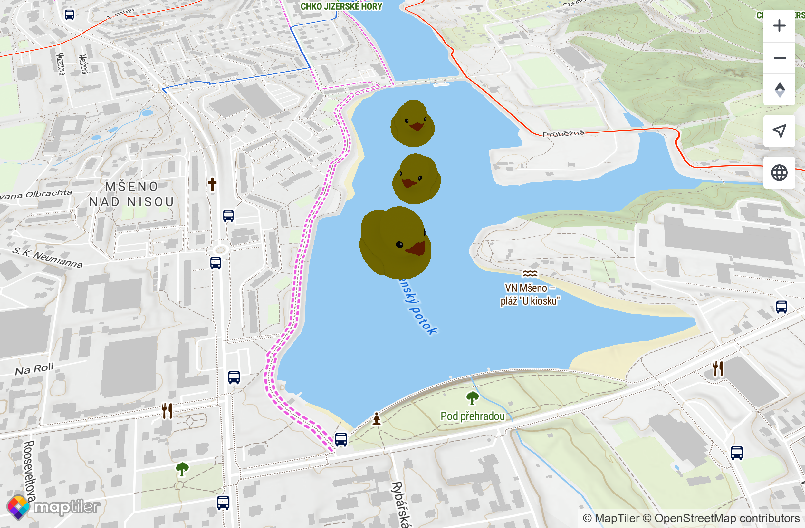
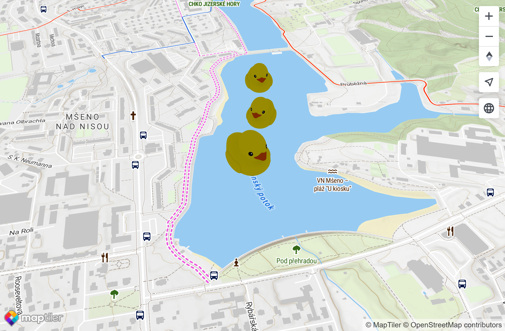

# Project scaffolding

Quick and easy by using Vite scaffolding with vanilla-ts template:

```sh
npm create vite@latest maptiler-hw -- --template vanilla-ts
```

# Adding MapTiler SDK

First, I install the package:

```sh
npm i @maptiler/sdk
```

Then, I copy the basic example from [SDK JS Examples](https://docs.maptiler.com/sdk-js/examples/ts-get-started/) to get a working map. It requires an API key though, so I solve this problem first. Creating an account creates a default key automatically, so I use that one. Remove extra code that was part of the template and the map runs just fine!

# Adding a projection control button

The SDK has a functionality for that so it's as simple as adding this to the config object:

```ts
projectionControl: true
```

# Time spent so far

The scaffolding and preparing a basic map took me cca 30 minutes. The SDK is well-documented and the documentation is on a very high level.

# Adding a rubber duck 3D model

I started by signing up into sketchfab.com to be able to download 3D models. Then, I followed yet another documentation page. First, a plugin must be installed because 3D is not included in the SDK by default:

```sh
npm i @maptiler/3d
```

The I add the code from the documentation, modifying it for my use. It runs just fine without any problems!

# Readme

Since the rubber duck model I had downloaded requires a CC attribution, I created a Readme file for it. And since I already had the file opened, I added other details to it as well. It should include all steps required, starting from a bare repository, up to building a production code.

# Deploying to GitHub Pages

Since this is a one-time task, I do it manually instead of using GitHub Actions or `gh-pages` npm package.

GitHub Pages run in a subdirectory so a Vite configuration was needed, as well as fetching the 3D model using a relative URL.

# Wrap-up

The app now features all the requirements as per the instructions. Coding the final version of the app took me cca 1,5 hours, including documentation and deployment.

## Biggest blockers

There wasn't any significant blocker on my way. The examples in the MapTiler SDK documentation are great for getting a grasp of a particular feature and are ready to be copied and tweaked.

GitHub Pages running in a subdirectory was a blocker for my initial approach but a quick google for `Vite baseUrl` yielded results in their documentation that I was able to use without problems to fix that.

## Screenshots

Initial version: 

Globe projection: 

Final version: 

# Follow-up task

Using a MapLibre layer for 3D content led me into the MapLibre documentation which is also clearly arranged and contains a lot of examples - and has a dark mode!

The examples section includes two basic approaches to adding a 3D model - using three.js and using babylon.js. After checking monthly npm downloads it seemed that three.js is much more popular so I went with that one.

First I checked that the example works fine with my MapTiler `Map` object instead of the original MapLibre GL one. Since MapTiler builds on top of MapLibre GL, there were no problems with that. The only problem was with types - the original code is written in JavaScript and does not translate to valid strict TypeScript directly. I solved this by using a class for the layer itself.

Then I went through the code of the example and started altering it to my needs. The `render` method includes two variants of the code, I went with the second, shorter one, and added rotation and scale logic on top of that myself; however the longer, more verbose code helped me understand what's going on. I replaced the two example directional lights with one ambient to make it simpler.

In the end, I refactored the example code to be self-contained in the class by moving the configuration into constructor params, and created three layers with three rubber ducks, just like in the original code. The overhaul took me cca 100 minutes of net time including the initial research, 20 more minutes went into writing these notes during the development and the final deployment to GitHub Pages, making the total time spent on the follow-up task cca 2 hours.

Follow-up version: 
